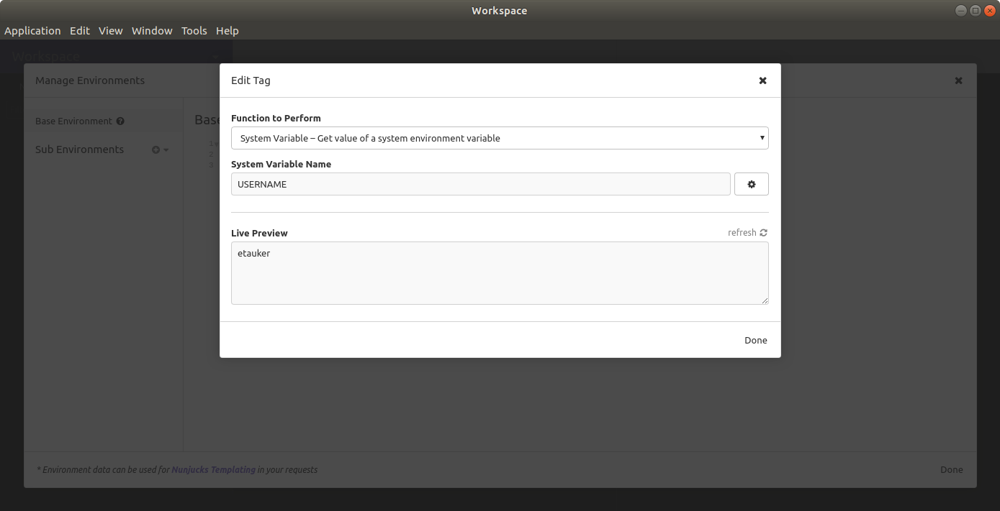
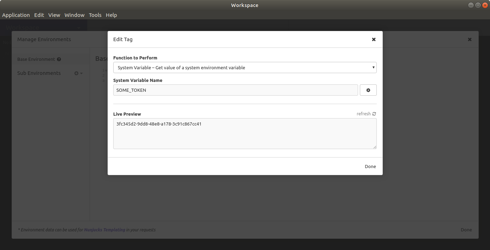

# Insomnia Plugin - System Env

A simple insomnia plugin that allows access to system environment variables from within insomnia.

## Examples

### Example 1
Access a system environment variable within insomnia.  

1. Get a list of environment variables:
```
$ env

USERNAME=etauker
HOME=/home/etauker
...
```

2. Provide the environment variable name in the template tag:



### Example 2
Access custom environment variable within insomnia.  

1. Set the variable from the same shell that you use to open insomnia (MacOS example below)
```
$ SOME_TOKEN=3fc345d2-9dd8-48e8-a178-3c91c867cc41 /Applications/Insomnia.app/Contents/MacOS/Insomnia
```

2. Use the custom environment variable name the same way as in example 1:

